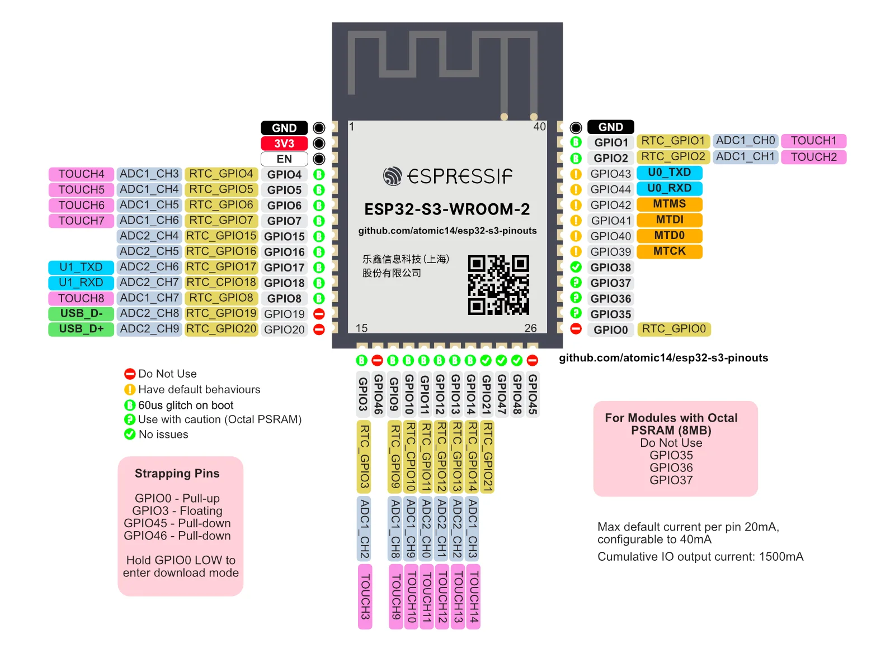
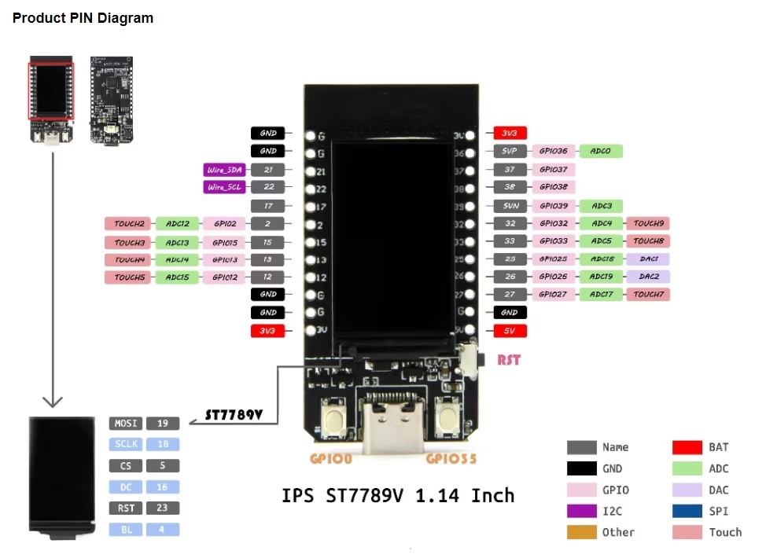

# Inventory

The inventory contains list of boards, sensors, switches, displays, ... and it's **inventory stocks**. Most of them was bought on AliExpress.

Author: Pawel Golawski, <pawel.golawski@2com.pl>

## Stock inventories

### Boards inventory

- 10x **ESP12F**

  
  

  > Notes:
  > - GPIO9 do not work (it hangs ESP)- reserved for flashing
  > - GPIO10 - use with caution, read [https://www.letscontrolit.com/forum/viewtopic.php?t=1462](https://www.letscontrolit.com/forum/viewtopic.php?t=1462)

- 6x **ESP32-WROOM-32D** (build-in antenna)

  

- 2x **ESP32-WROOM-32U** (IPEX, no built-in antenna)

  > Pinout is the same as ESP32-WROOM-32D

- 3x **ESP32-WROOM-32UE** (IPEX, no built-in antenna)

  > Pinout is the same as ESP32-WROOM-32D

- 1x **ESP32S** (IPEX or built-in antenna)

  

- 13x **ESP32-WROOM-32 expansion board** (to solder)

  
  
  

- 1x **ESP32-D1 mini**

  

- 5x **ESP32-C3 super mini**

  
  

- 2x **ESP32-C3 super mini plus** (RGB led + IPEX option)

  > Pinout is the same as ESP32-C3 super mini.
  >
  > Note: GPIO8 is connected to RGB LED.

- 1x **ESP32-C6-WROOM-1-N8** (dev board with 2x usb-c)

  

  > Note: GPIO8 is connected to RGB LED
  >
  > Full reference: [https://github.com/wuxx/nanoESP32-C6](https://github.com/wuxx/nanoESP32-C6)

- 1x **ESP32-C6 mini** (dev board with 1.27mm pins)

  

- 1x **ESP32-C6 supermini**

  

  > Notes:
  > - GPIO15 is connected to blue LED.
  > - GPIO8 is connected to RGB LED.
  > - Green LED (BAT) is not connected to any of GPIO, it shows when battery is charging. fast blinks where battery is disconnected.

  > WARNING: This board work only with esp-idf framework (no arduino) and throws some frequent warnings, like:
  > - `[W][web_server_idf:070][httpd]: Only application/x-www-form-urlencoded supported for POST request`
  > - `[I][esp-idf:000][httpd]: W (59638) httpd_txrx: httpd_sock_err: error in recv : 104`

- 0x (+1) **ESP32-S3 supermini**

  
  > Notes:
  > - GPIO48 is connected to RGB LED and blue LED.

- 1x **ESP32-S3 N16R8**

  

- 1x **ESP32-S3 N16R8** (dev board with 2x usb-c)

  
  > Notes:
  > - Connect pads next to RGB let to have 5V output on 5V pin
  > - GPIO43 is connected to green LED.
  > - GPIO44 is connected to blue LED.
  > - GPIO48 is connected to RGB LED.
  > - PSRAM (may) require to include platformio_options as described in [https://community.home-assistant.io/t/esp32-s3-devkitc-1-n16r8-using-psram-howto](https://community.home-assistant.io/t/esp32-s3-devkitc-1-n16r8-using-psram-howto)

- 0x **ESP32-S3 N8R2** (dev board with 2x usb-c)

  > Pinout the same as N16R8 above.
  > Notes:
  > - Connect pads next to RGB let to have 5V output on 5V pin
  > - GPIO43 is connected to green LED.
  > - GPIO44 is connected to blue LED.
  > - GPIO48 is connected to RGB LED.
  > - PSRAM (may) require to include platformio_options as described in [https://community.home-assistant.io/t/esp32-s3-devkitc-1-n16r8-using-psram-howto](https://community.home-assistant.io/t/esp32-s3-devkitc-1-n16r8-using-psram-howto)
  > - DO NOT use 5V pin, as it provides 3.3V only and od not deliver enough power for I2C devices (those are recognized during scan, but won't work)

- 2x **ESP32-S2FN4R2 mini** (dev board with usb-c)

  

  > WARNING: GPIO19 and GPIO20 are connected to USB-C connector, do not use them for I2C or other purposes as board will have no web, but respond on ping
  >
  > WARNING: To flash this board for the first time need to:
  > 1. Hold 0 (BOOT)
  > 2. Short press RST (RESET)
  > 3. Release 0 (BOOT) after a few seconds (to allow computer to recognize USB)

- 1x **T-Display ESP32** (dev board with usb-c and 1.14 LCD color display)

  

  > NOTE: Board has TF card slot, sliding power switch, micro-USB, battery connector (JST GH 2pin)
  > NOTE: Board version is v1.1 XY-CP

### Displays inventory

- 0x **WeAct Studio 2.90** inch ePaper module, 296 x 128 px (91.8 x 37.5 mm)

  

- 1x **WeAct Studio 2.13** inch ePaper module, 250 x 122 px (72 x 30 mm)

  

- 1x **LILYGO T5-4.7** ePaper with ESP32 full development board (ESP32-WROVER-E N16R8)

  

  > NOTE: Board version is ESP32-WROVER-E N16R8

- 1x **LILYGO TTGO LoRa32** (SX1276 for 433MHz) with LCD display (SSD1306) and ESP32-PICO-D4 full development board

  

  > NOTE: Board has TF card slot, sliding power switch, micro-USB, battery connector (JST GH 2pin)
  > NOTE: Board version is T3_v1.6.1
  > Full board description: [https://github.com/LilyGO/TTGO-LoRa32-V2.1](https://github.com/LilyGO/TTGO-LoRa32-V2.1)
  >
  > Other possible solutions:
  > - [OpenMQTTGateway](https://docs.openmqttgateway.com)
  > - [Zephyr OS](https://docs.zephyrproject.org/latest/introduction/index.html)

- 1x **LCD PCF8574 2x16** (line x character) display via I2C

  

- 1x **LCD SSD1306, 0.96** inch b-w I2C OLED, 128 x 64 px (22 x 10,9 mm) SSD1315?

  
  

- 1x **LCD SSD1306, SH-S091, 0.91** inch b-w I2C OLED, 128 x 32 px (22 x 5,6 mm)

  

  > Size of module: 38 x 12 mm

- 1x **LCD ST7735, GMT130-v1.0, 1.3inch** color SPI TFT, 240 x 240 px (23,4 x 23,4 mm) via I2C

  
  

### Sensors inventory

- 5x `A` - **APDS9660** - Illuminance, Color(s), Gesture and Motion
- 10x (-1) `B` - **BH1750** - Illuminance
- `C` - **SCD40** - CO2, Temperature, Humidity
- 4x (+2) 1m `D` - **DS18B20** (Dallas) - Temperature
- 1x 2m `D` - **DS18B20** (Dallas) - Temperature
- 2x `E` - **INA226** - DC Current, Power, Voltage (max. 30V DC)
- 2x `F` - **INA3221** - 3-channel DC Current, Power, Voltage (max. 26V DC)
- 3x `G` - **BME680** - Temperature, Humidity, Pressure, Gas Resistance
- 0x `H` - **AHTx21** - Temperature and Humidity
- 1x `I` - **IR Receiver 38KHz** (Open-Smart, 1pin with signal)
- 2x `L` - **LD2410B** - Radar sensor 24GHz
- 2x `L` - **LD2410C** - Radar sensor 24GHz
- 2x `L` - **LD2420** - Radar sensor 24GHz
- 5x (+4) `M` - **INMP441** - I2S microphone
- 2x `N` - **ENS160** - TVOC and eCO2
- 6x `O` - **SGP30** - TVOC and eCO2
- 2x (-1) `P` - **BME280** - Temperature, Humidity, Pressure
- 2x `R` - **RC522** - RFID tag sensor
- 11x `S` - **SHTx30** - Temperature and Humidity
- 2x 1m `S` - **SHTx30** - Temperature and Humidity as waterproof probe
- 0x `T` - **TCS3472** - Illuminance and Color(s)
- 0x `U` - **LTR390** - UV and Illuminance
- 2x `V` - **VL53L0x** - Distance (laser)
- 4x `W` - **HC-SR04** - Distance (acoustic)
- 1x `Y` - **YF-B10 G1** - Water Pulse sensor

### Switches/Actuators inventory

- 2x `a` - **AVT5713** - Double Light Switch Board (mounted)
- 7x `a` - **AVT5713** - Double Light Switch Board (not mounted - bare board)
- 5x `x` - ***ESP01S Single Relay** Board (generic from Aliexpress)
- 0x `b` - **9032A/9025A** - Active Buzzer 9mm diameter x 3.2/2.5mm height
- 1x `i` - **IR Transmitter 38KHz** (Open-Smart, 1pin with signal)
- 6x `r` - **9032/9025** - Passive Buzzer 9mm diameter x 3.2/2.5mm height (soldered package)
- 5x (+10) `r` - **9032/9025** - Passive Buzzer 9mm diameter x 3.2/2.5mm height
- 1x (-1)(+9) `m` - **Max98357** -  I2S mono amplifier
  > Note: Amp use cases 
- 2x (+2) `s4` - small speaker 4 Ohm (1 - 3 W)
- 0x (+6) `s8` - small speaker 8 Ohm (0.5 - 1 W)

### Other inventories

#### Other

- 1x **FRAM** 32KB
- 5x 2ch DC level converter 5V <> 3.3V
- 5x DC level converter 5V <> 3.3V (I2C, SPI, UART)
- 10x 4ch DC level converter 5V <> 3.3V (I2C)
- 2x **RS485 to TTL** (3.3 - 5V)
- 2x **D4184** MOSFET (max 40V, 50A)
- 4x **LR7843** MOSFET (max 30V, 161A)

#### Development boards

- 1x ESP12 development board, fits ESP12E, ESP12F
- 1x ESP32 development board
- 6x ESP32C3 pin board (require ESP32C3 supermini, ESP32C3 supermini plus, ESP32S6 supermini, ESP32S3 supermini)

#### USB modules

- 5x UCB-C (white) DC connector (for case)
- 5x UCB-C (black) DC connector (for case)
- 1x USB-A board (for inside case)
- 2x USB to RS485

#### Full configurations (bought as device)

- 1x DYI Smart Switch (on bk7231n) - 230V
- 1x ESP32-CAM

#### Power modules/boards and relays

- 1x AC 230V to DC 3.3V board (with Hi-Link module)
- 7x AC 230V to DC 3.3V Hi-Link module
- 9x AC 230V to DC 5V Hi-Link module
- 3x DC 30V to DC 3.3V board
- 8x DC 30V to DC 5V board
- 0x (+1) AC 230V to DC 5V (1A) board
- 14x single relay SRD-05DC-SL-C (5V)
- 4x single relay HFD4-3V-S (3.3V)
- 7x AVT5785 board (to put 230C to (5V or 3.3V) Hi-Link module)
- 2x AC 110-240V to DC 12V 1A module in white indoor case
- 1x AC 110-240V to DC 12V 1.5A module in white indoor case
- 1x AC 110-240V to DC 12V 2A module in black outdoor case
- 4x XL74610 ideal diode (1.5-30V, 15-30A max) - to protect against reversed polarity

#### Cases (width x hight x thickness)

- 1 + 4x white waterproof IP65 box (various sizes)
- 3x white plastic box 60mm x 30mm x 15mm
- 5x (-1) white plastic box 90mm x 40mm x 15mm
- 4x color buttons for a case
- 1x white plastic box 75mm x 75mm x 30mm
- 1x white plastic box 100mm x 100mm x 36mm

#### Breadboards (X x Y pins)

- 7x  17x10 pins, 47x35 mm (multicolor, black, white)
- 7x  11x5 pins, 30x25 mm (multicolor)
- 6x  5x5 pins, 20x15 mm (multicolor)

## Device configurations

To be added

### Rooms

#### Entrance

- PRODUCTION since: ~ 2022
- Script `esp12f_THIPGbdss_BGr__G.yaml`.
- Alias `esp12f-11_Entrance_Entry`.

ESP12F board with Temperature, Humidity, Pressure, Gas and Illuminance sensors. Powered from intercom 12V bus. Board has a switch to open gate and sensor to check if intercom button is pressed. Whole device is put inside intercom.

Components:

- 1x ESP12F
- 1x `G` - BME680 - Temperature, Humidity, Pressure, Gas Resistance
- 1x `B` - BH1750 - Illuminance
- 1x `b/r` - 9032 - Passive Buzzer 9mm diameter x 3.2mm height
- 1x `d` - status diode (red)
- 1x single relay HFD4-3V-S (3.3V)

#### Upstairs

- PRODUCTION since: ~ 2022
- Script `esp12f_THP_P.yaml`.
- Alias `esp12f-15_Upstairs`.

ESP12F board with Temperature, Humidity, and Pressure sensors. Powered from intercom 12V bus.

Components:

- 1x ESP12F
- 1x `P` - BME280 - Temperature, Humidity, Pressure
- 1x white plastic box 60mm x 30mm x 15mm

#### Office

TBD

#### Salon

- PRODUCTION since: 2025 Jan
- Script `esp32s3_THIGPEOdbi_GBIi.yaml`.
- Alias `esp32-14_Salon`.

ESP32 board with IR Receiver and IR Transmitter, Temperature, Humidity, Pressure and Illuminance sensors. Includes Voice Assistant as well (mic and speaker) Powered from 230V.

Components:

- 1x ESP32-S3 N8R2 (dev board with 2x usb-c)
- 1x `G` - BME680 - Temperature, Humidity, Pressure, Gas Resistance
- 1x `B` - BH1750 - Illuminance
- 1x `I` - IR Receiver 38KHz (Open-Smart, 1pin with signal)
- 1x `M` - INMP441 - I2S microphone
- 1x `i` - IR Transmitter 38KHz (Open-Smart, 1pin with signal)
- 0x (+1) `m` - Max98357 -  I2S mono amplifier
- 0x (+1) `s4` - small speaker 4 Ohm
- 1x `b/r` - 9032 - Passive Buzzer 9mm diameter x 3.2mm height
- 1x `d` - status diode (red)
- 1x white plastic box 75mm x 75mm x 30mm

### Outside

#### Shades

- PRODUCTION since: June 2024
- Script `esp32_THIUGPdb_GSUBr_display.yaml`.
- Alias `esp32-05_Shades_WinterGardenUpp`.

ESP32 board with Temperature, Humidity, Pressure, Gas Resistance, UV and Illuminance sensors. Powered from alarm/security 12V bus.

Components:

- 1x ESP32-WROOM-32
- 1x ESP32-WROOM-32 expansion board (to solder)
- 1x `G` - BME680 - Temperature, Humidity, Pressure, Gas Resistance
- 1x `S` - SHTx41 - Temperature and Humidity
- 1x `U` - LTR390 - UV and Illuminance
- 1x `B` - BH1750 - Illuminance
- 2x `b/r` - 9032 - Passive Buzzer 9mm diameter x 3.2mm height
- 4x `d` - status diode (red, green; red, blue)
- 1x DC 30V to DC 3.3V board
- 2x Transparent IP44 case (gray)
- 1x WeAct Studio 2.90 inch ePaper module, 296 x 128 px (91.8 x 37.5 mm)

#### Attic

- PRODUCTION since: TBD
- Script `esp32_THPI_SBPD.yaml`.
- Alias `esp32-39_Attic`.

ESP32 board with Temperature, Humidity, Pressure and Illuminance sensors. Powered from 230V.

Components:

- 1x ESP32-WROOM-32, with antenna connector
- 1x ESP32-WROOM-32 expansion board (to solder)
- 1x 1m `D` - DS18B20 (Dallas) - Temperature
- 1x `P` - BME280 - Temperature, Humidity, Pressure
- 1x `B` - BH1750 - Illuminance
- 1x `S` - SHTx30 - Temperature and Humidity as waterproof probe
- 1x ? white plastic box 90mm x 40mm x 15mm
- 1x AC 230V to DC 3.3V board (with Hi-Link module)

### Measures

#### Garage, Pump

- PRODUCTION since: Sep 2023
- Script `esp32_THIWdb_SBYr_display.yaml`.
- Alias `esp32-35_Pump_Garage`.

ESP32 board with Temperature, Humidity, and Illuminance sensors. Powered from micro USB-A. Saves total counters in FRAM.

Components:

- 1x ESP32-D1
- 1x 1m `S` - SHTx30 - Temperature and Humidity as waterproof probe
- 1x 1m `D` - DS18B20 (Dallas) - Temperature
- 1x `B` - BH1750 - Illuminance
- 1x `Y` - YF-B10 G1 - Water Pulse sensor
- 1x `b/r` - 9032 - Passive Buzzer 9mm diameter x 3.2mm height
- 1x `d` - status diode (red)
- 1x FRAM 32KB
- 1x WeAct Studio 2.90 inch ePaper module, 296 x 128 px (91.8 x 37.5 mm)
- 1x Transparent IP44 case (gray)

#### Aquarium Window

- PRODUCTION since: ~ 2022
- Script `esp12f_THIddb_STr.yaml`.
- Alias `esp12f-25_AquariumWindow`.

ESP12F board with Temperature, Humidity, Illuminance and Color sensors. Powered from alarm/security 12V bus.

Components:

- 1x ESP12F
- 1x `S` - SHTx30 - Temperature and Humidity
- 1x `T` - TCS3472 - Illuminance and Color(s)
- 1x `b/r` - 9032 - Passive Buzzer 9mm diameter x 3.2mm height
- 1x `d` - status diode (blue)
- 1x `d` - measurement diode (white) on TCS3472
- 1x white plastic box 60mm x 30mm x 15mm

#### Under Floor

- PRODUCTION since: ~ 2022
- Script `esp12f_THdb_SDr.yaml`.
- Alias `esp12f-21_Underfloor`.

ESP12F board with Temperature, Humidity sensors. Powered from 12V DC (from 230V charger).

Components:

- 1x ESP12F
- 1x 30cm `S` - SHTx30 - Temperature and Humidity as waterproof probe
- 2x 1m `D` - DS18B20 (Dallas) - Temperature
- 1x `b/r` - 9032 - Passive Buzzer 9mm diameter x 3.2mm height
- 0x `d` - status diode (not connected, in script only for RTTTL to work)
- 2x white plastic box 60mm x 30mm x 15mm (1 for 12V->3V converter, 1 for ESP12F)
